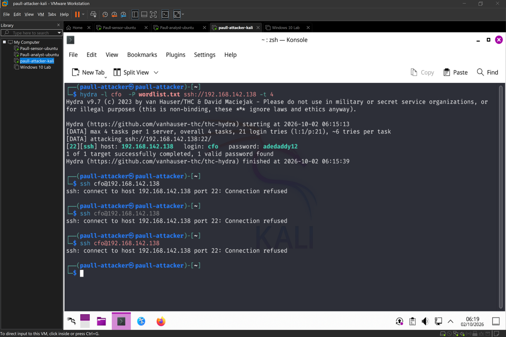
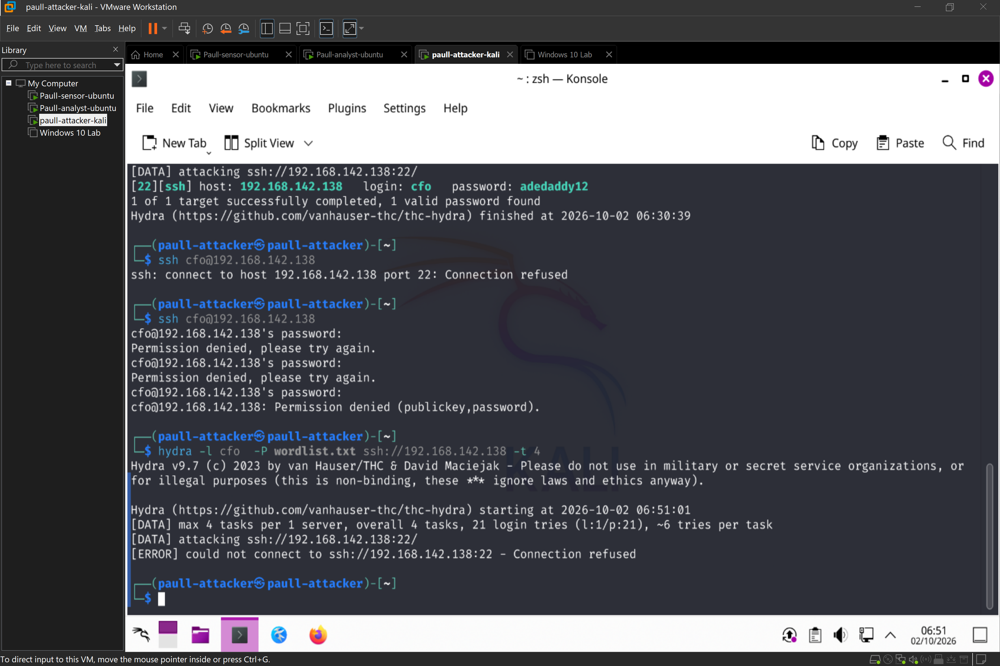
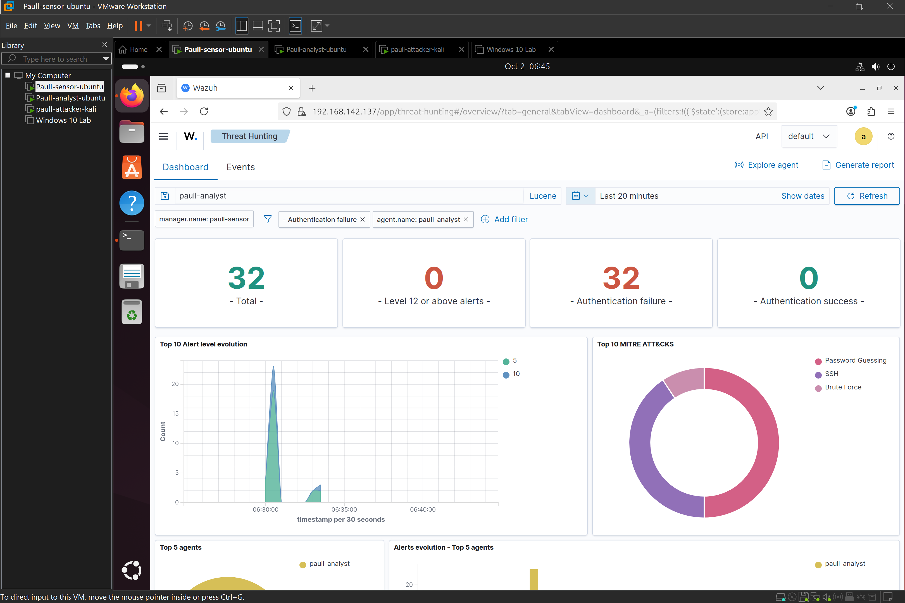
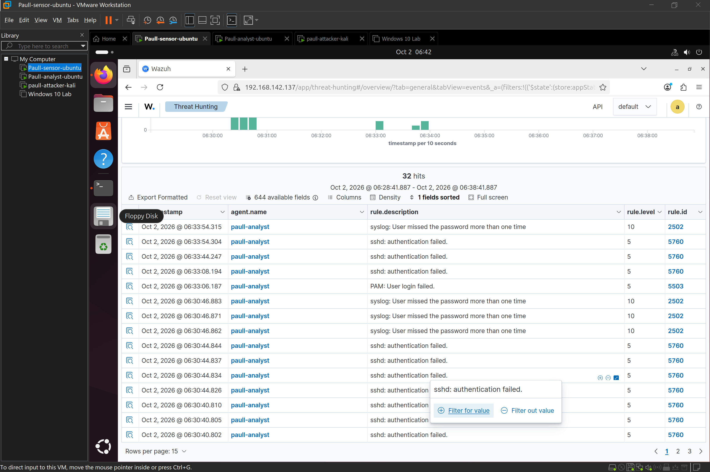
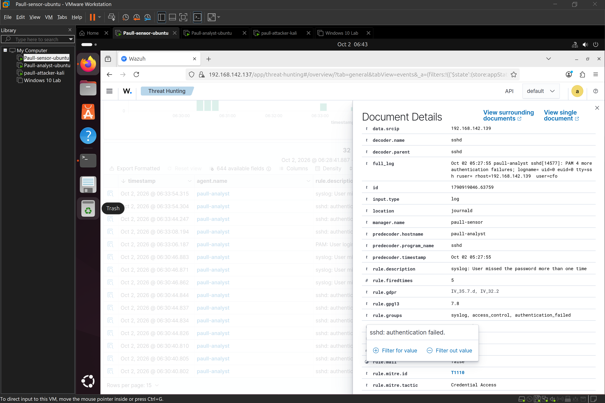
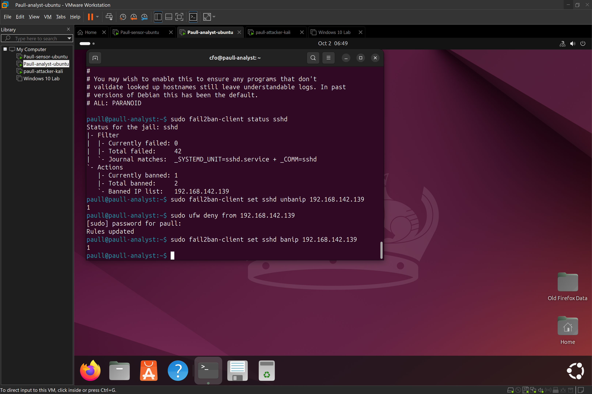

# Brute-Force-Attack-Detection-Response-WAZUH

## Objective
Detect and respond to SSH brute-force attempts against a Linux server using Wazuh SIEM — a different stack from my earlier ELK-based SIEM series.

## Environment
| Role | Hostname | Tool Stack |
|---|---|---|
| Attacker | paull-attacker-kali | Kali Linux, Hydra |
| Victim | paull-analyst | Ubuntu Server, OpenSSH, Wazuh Agent |
| SIEM | paull-sensor | Ubuntu Server, Wazuh Manager + Indexer + Dashboard |

Note: paull-sensor previously ran the ELK stack for an earlier lab handson. Elasticsearch and Kibana were stopped and disabled  to free ports 9200/9300 for Wazuh's indexer, since both stacks compete for the same ports. Either stack can be re-enabled on demand; but can't run simultaneously.

## Setup

**1. Wazuh all-in-one install on paull-sensor:**
``` yaml bash
curl -sO https://packages.wazuh.com/4.14/wazuh-install.sh
sudo bash wazuh-install.sh -a
```
Installs manager, indexer, and dashboard together. Admin credentials are generated during install and stored in `wazuh-install-files.tar`:
```bash
sudo tar -O -xvf wazuh-install-files.tar wazuh-install-files/wazuh-passwords.txt
```

Dashboard accessed at `https://192.188.142.***`.

**2. Victim preparation on paull-analyst:**
```bash
sudo apt install openssh-server -y
sudo systemctl enable --now ssh
sudo adduser cfo
```

**3. Wazuh agent installed and registered on paull-analyst**, using the install command generated by the dashboard's "Deploy new agent" wizard :
``` yaml bash
wget https://packages.wazuh.com/4.x/apt/pool/main/w/wazuh-agent/wazuh-agent_4.14.8-1_amd64.deb
sudo WAZUH_MANAGER='192.168.142.***' WAZUH_AGENT_NAME='paull-analyst' dpkg -i ./wazuh-agent_4.14.8-1_amd64.deb
sudo systemctl enable --now wazuh-agent
```

**4. Verified agent connectivity and log flow** via Agents management (status: Active) and Security Events, filtered by agent name, confirming real-time ingestion of SSH auth events.

## Attack Simulation

```bash
hydra -l cfo -P short_wordlist.txt ssh://192.168.142.***
```

## Detection

Wazuh's built-in correlation rules fired without any custom rule configuration needed:

| Rule ID | Severity | Description |
|---|---|---|
| (individual failures) | 5 | SSH authentication failure (per failed attempt) |
| 5760 | 10 | Multiple authentication failures — brute-force correlation |

**Source IP:** matched the Kali attacker host, as expected.
**Timestamp:** Oct 2, 2026 @ 06:30:46 — first correlated high-severity alert.

Worth noting in this writeup: Wazuh escalates severity automatically once it correlates a pattern of repeated low-severity failures (severity 5, each individual failed login) into a single higher-severity brute-force alert (severity 10, rule 5760) — this correlation logic is built in and required no manual threshold configuration.

## Containment

``` yaml bash
sudo ufw deny from 192.168.142.***
sudo ufw status
```

Verified by re-running Hydra post-block — connections were refused/timed out rather than attempting authentication, confirming my block was effective.

**Trouble encountered** a  `fail2ban` installation from an earlier incident-response lab had already auto-banned the Kali IP mid-session, before this manual ufw block was even applied, which initially looked like a bug (SSH "connection refused" despite the service running and no ufw/iptables rule present) but turned out to be fail2ban correctly doing its job from a prior lab's remediation step. fail2ban was temporarily stopped to allow Hydra to complete its run for this exercise, then restarted afterward.

## Incident Report SSH Brute Force

``` yaml 2.0
Date/Time: October 2, 2026, 06:30:46
Target Host: paull-analyst (Ubuntu-Victim)
Source IP: 192.168.142.1**9
Wazuh Rule Triggered: 5760 - Multiple authentication failures (severity 10), 
                       preceded by individual rule-matched SSH auth failures (severity 5)
Failed Attempt Count: 32
Successful Compromise? Y — correct password found via dictionary attack
Containment Action: ufw block applied against source IP; verified effective via 
                     re-attempted connection (refused)
Recommendation: 
  - Enable fail2ban permanently (already present on this host from a prior handson lab; 
    confirmed functional during this exercise)
  - Enforce SSH key-based authentication, disable password login entirely
  - Consider lowering Wazuh's brute-force correlation threshold if faster 
    detection is desired for production use
```

# Evidence








## Tools Used
- Kali Linux, Hydra
- Ubuntu Server, OpenSSH, ufw, fail2ban
- Wazuh (Manager, Indexer, Dashboard, Agent)
